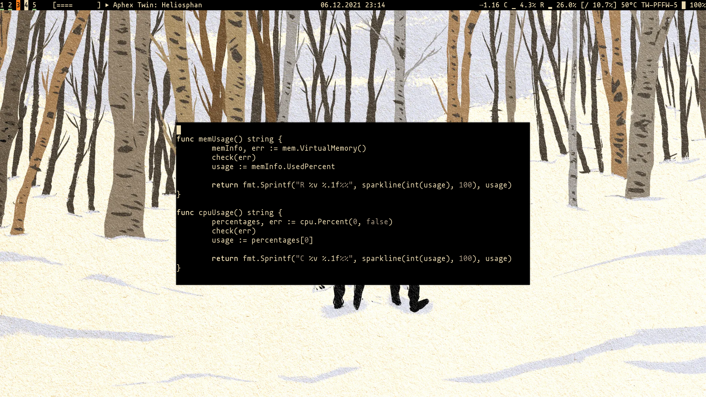

## sabar - Sami's bar

sabar is a simple system status script intended to be piped to lemonbar

### host dependencies:
+ acpi		(acpi)			battery information
+ bspc		(bspwm)			bspwm desktop states
+ iwgetid		(wireless_tools)	currently connected ssid
+ killall		(psmisc)		for killing a existing instance
+ lemonbar	(lemonbar-xft)		for actually displaying something on screen
+ mocp		(moc)			currently playing music status
+ a patched font  (nerd-fonts-ttf)        for icons

### go dependencies:
+ gopsutil

### TODO:
+ Actual Makefile with install and uninstall steps
+ Allow (bspwm) colors be passed as arguments (or add a support for a
  configuration file)
+ Fix error handling by logging at site instead of calling `check` (check
  loses line context)
+ Remove psmisc dependency, write PID to a file and use kill instead
